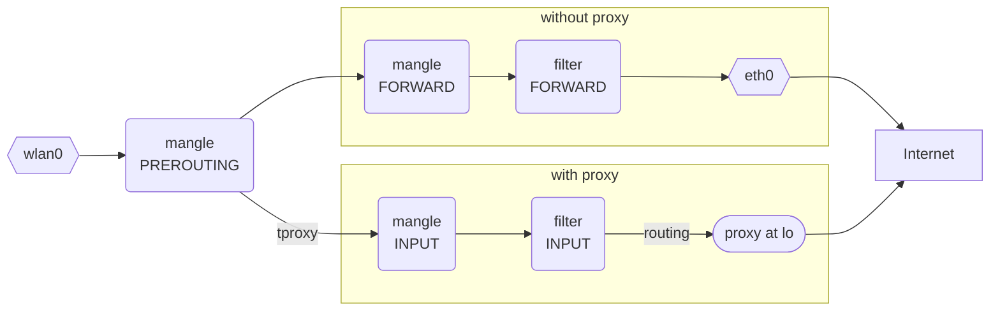

Use `./up.sh` instead of `docker compose up -d` to generate config.yaml with senstives.

## Transparent Proxy

> ⚠️ UNDER CONSTRUCTION
> - UDP forward
> - DNS
> - Persistence of iptables and ip rule, ip route

### WiFi Hotspot Sharing Proxy

#### How It Works

The iptables flow of packets (the complete traversal can be found [here](https://www.frozentux.net/iptables-tutorial/iptables-tutorial.html#TRAVERSINGOFTABLES)):

> `raw`, `nat` table and `POSTROUTING` chains are omitted.



#### Hotspot

```shell
nmcli con add type wifi ifname wlan0 con-name MyHotspot autoconnect yes ssid $YOUR_SSID
nmcli con modify MyHotspot 802-11-wireless.mode ap
nmcli con modify MyHotspot ipv4.method shared
nmcli con modify MyHotspot wifi-sec.key-mgmt wpa-psk
nmcli con modify MyHotspot 802-11-wireless.band a # `a` is 5GHz, `bg` is 2.4GHz
nmcli con modify MyHotspot wifi-sec.psk $YOUR_PASSWORD
nmcli con up MyHotspot
```

#### Proxy

Use https://github.com/zfl9/ipt2socks to convert network layer traffic to socks5, which listens on 127.0.0.1:60080 by default.

#### Iptables

```shell
iptables -t mangle -N NAIVE
iptables -t mangle -A NAIVE ! -d 10.42.0.0/24 -p tcp -j TPROXY --on-ip 127.0.0.1 --on-port 60080 --tproxy-mark 626
iptables -t mangle -A PREROUTING -i wlan0 -j NAIVE
```

- `10.42.0.0/24` is the subnet of `wlan0`
- `mark` can be any as long as not conflict

#### Routing

```shell
ip rule add fwmark 626 table 626
ip route add local 0.0.0.0/0 dev lo table 626
```

- `fwmark` need to be identical as `mark` of the iptables rule
- `table` can be any as long as not conflict

#### UFW

UFW's iptables chain `ufw-not-local` at table `filter` would interfere with `tproxy`-ed packets since `tproxy` does not modify the dst address of packets and `ufw-not-local` would drop any packets not towards local, unicast or broadcast before the traversal into the user-defined chain `ufw-user-input`.
Fix (https://github.com/zfl9/ss-tproxy/issues/199):

- Modify `/etc/ufw/before.rules`, append the following under `-A ufw-before-input -j ufw-not-local`:

    ```
    # if TPROXY, RETURN
    -A ufw-not-local -m mark --mark 626 -j RETURN
    ```

- Add explicit allow from `wlan0` if UFW is in whitelist mode:

    ```shell
    ufw allow from 10.42.0.0/24 comment 'wlan0'
    ```

> Some packets could still be blocked, but the iptables tracing (`TRACE` target, very useful for debugging) suggests that it is due to `ctstate INVALID` in chain `ufw-before-input`. So it might have no undesirable effects (?).
